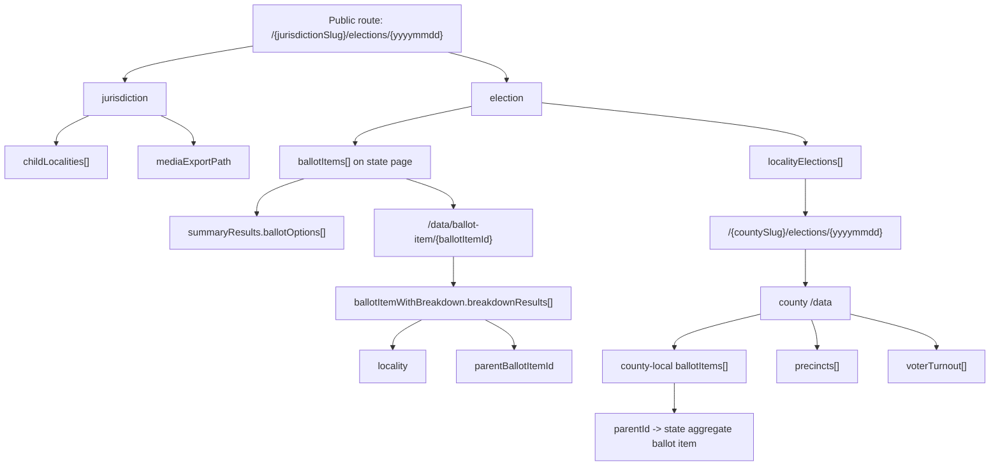
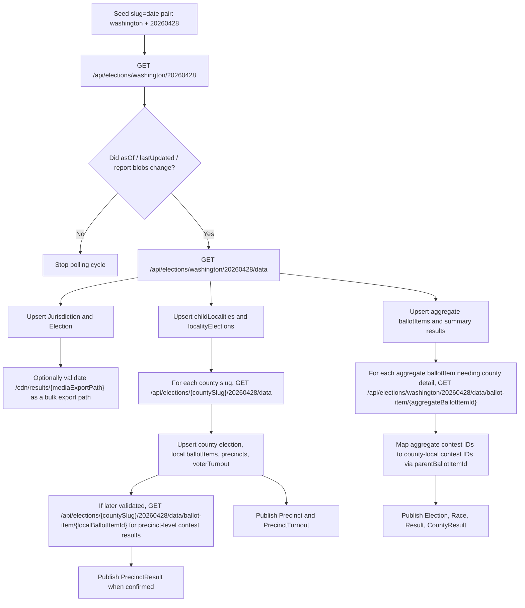

# VoteWA Public Results HAR Analysis

## Executive Summary

The HAR confirms that the VoteWA public results application at `results.votewa.gov` is a public, client-side single-page app that reads data from a same-origin JSON API rooted at `/results/public/api`. The canonical public route captured in the HAR is:

```text
https://results.votewa.gov/results/public/washington/elections/20260428
```

The strongest reusable endpoints in this capture are:

```text
GET /results/public/api/elections/{jurisdictionSlug}/{yyyymmdd}
GET /results/public/api/elections/{jurisdictionSlug}/{yyyymmdd}/data
GET /results/public/api/elections/{jurisdictionSlug}/{yyyymmdd}/data/ballot-item/{ballotItemId}
GET /results/public/api/elections/{jurisdictionSlug}/{yyyymmdd}/closeraces
```

Those endpoints were fetched without any `Authorization` header, cookie, CSRF token, or query-string token on the VoteWA host. The first-party JSON responses were cacheable with `Cache-Control: public, max-age=60`, and the public client code polls for changes on a two-minute interval. In other words, this is not a gated voter-services API hidden behind login in the captured flow; it is a public results API consumed directly by the browser.

From this one HAR, you can already ingest a substantial amount of reusable data:

- **Election metadata** at state and county scope.
- **Jurisdiction metadata** and participating county slugs.
- **Aggregate contest or race records** through `ballotItems`.
- **County-level breakdowns** for at least one clicked ballot item on the statewide page.
- **County-local contest IDs** that map back to statewide aggregate contest IDs.
- **Precinct IDs and precinct turnout rows** from the Mason County locality page.

The strongest caveat is scope. This April 2026 special-election capture only exercised ballot measures, not candidate contests. So the public API surface is real and reusable, but the HAR does **not** directly prove candidate-specific payloads such as partisan candidate lists for a primary or general election. The client model strongly suggests those are delivered through the same `ballotItems` / `ballotOptions` structures, but that remains an inference from the client bundle rather than a directly observed candidate-race response.

A second caution is that the state-level aggregate page and county-level pages are **not using the same contest IDs**. Statewide aggregate ballot items have one ID; county-local ballot items have their own IDs and point back to the aggregate via `parentId` or `parentBallotItemId`. Any adapter needs to model that hierarchy explicitly.

## Capture Scope and Evidence

The HAR contains **85 network entries** in total. Of those, **39** were to `results.votewa.gov`, **33** to `api.mapbox.com`, **5** to `events.mapbox.com`, and the rest to Google-related static or telemetry endpoints. All first-party results traffic was `GET`; no first-party `POST` requests were observed.

The page title in the HAR itself pins the public 2026 route exactly:

```text
https://results.votewa.gov/results/public/washington/elections/20260428
```

The client configuration embedded in the captured JavaScript is the single most important architectural clue. The bundle exposes the production path base, the API base, the CDN base, and an admin GraphQL endpoint that was **not** used by the public page:

```js
api:{endpoint:"/results/public/api",graphQlEndpoint:"/admin/gateway/graphql"},
imageCdn:"/cdn/results/",
cdn:"/cdn/results",
pathBase:"/results/public"
```

The bundle also exposes the public REST service methods used by the client:

```js
getCloseRaces(t,r){ return this.http.get(`${this.baseUrl}/elections/${t}/${r}/closeraces`) }

getData(t,r,o){
  let i=`${this.baseUrl}/elections/${t}/${r}/data`;
  if (o) i += `/ballot-item/${o}`;
  return this.http.get(i)
}

getAllLocalityElections(a,p){ return this.http.get(`${this.baseUrl}/elections/${a}/${p}/localities`) }
getStatistics(a,p){ return this.http.get(`${this.baseUrl}/elections/${a}/${p}/stats`) }
getLocalityVoterRegistration(a,p){ return this.http.get(`${this.baseUrl}/elections/${a}/${p}/vr`) }
getPrecinctVoterTurnout(a,p){ return this.http.get(`${this.baseUrl}/elections/${a}/${p}/turnout`) }
getJurisdiction(t,r){ return this.http.get(`${this.baseUrl}/jurisdictions/${t}${r?"/"+r:""}`) }
```

The public router definitions were also present in the captured bundles. They show the canonical route shape and the major public result subpages:

```js
path:":name/:id", redirectTo:":name/elections/:id"
path:":name/elections/:id"
children: [
  "",
  "ballot-items/:ballotItemId",
  "precincts",
  "polling-places",
  "stats",
  "voters",
  "reporting-statuses",
  "close-races",
  "reports"
]
```

That matters because it means the HAR gives you both **confirmed network calls** and **bundle-referenced but not yet exercised routes**.

The first-party API calls in the HAR were plain JSON `GET`s with an `Accept: application/json, text/plain, */*` header. I found **no** first-party `Authorization` header, cookie, session token, or CSRF token in the captured requests. I also found **no** WebSocket traffic, no Server-Sent Events, and no public GraphQL requests. The public page is therefore operating as a pull-based JSON client, not as a push channel.

The public response headers were also consistent and useful operationally. The main JSON endpoints returned `application/json; charset=utf-8`, were served by Cloudflare, and were cacheable for one minute:

```text
Cache-Control: public, max-age=60
Server: cloudflare
```

That is a strong indicator that a polling ingestion strategy on a **60–120 second cadence** is consistent with how the site itself is designed.

## Discovered Endpoints

### Confirmed and inferred endpoint inventory

| Endpoint pattern | Evidence level | What it returns | Importance | Notes |
|---|---|---|---|---|
| `/results/public/washington/elections/20260428` | Confirmed in HAR | HTML document for the public 2026 state route | High | This is the canonical public route captured in the HAR. |
| `/results/public/api/elections/washington/20260428` | Confirmed in HAR | State election metadata JSON | High | Best “change detector” endpoint; includes `asOf`, `lastUpdated`, report metadata, and map settings. |
| `/results/public/api/elections/washington/20260428/data` | Confirmed in HAR | Composite statewide results payload | Highest | Best single-call ingest endpoint for the state page. |
| `/results/public/api/elections/washington/20260428/closeraces` | Confirmed in HAR | Close-races array | Medium | Returned `[]` in this capture. Optional for UI parity, not core ingestion. |
| `/results/public/api/elections/mason-county-wa/20260428/data` | Confirmed in HAR | County-local results payload | Highest | Crucial for locality-scoped contests, precinct IDs, and precinct turnout rows. |
| `/results/public/api/elections/mason-county-wa/20260428/closeraces` | Confirmed in HAR | County close-races array | Medium | Also returned `[]` here. |
| `/results/public/api/elections/{jurisdictionSlug}/{yyyymmdd}/data/ballot-item/{ballotItemId}` | Confirmed in HAR and confirmed in bundle | Detailed contest payload with `ballotItemWithBreakdown` | Highest | This is the reusable “drilldown” endpoint. On the state page it returned county breakdowns for a cross-county ballot measure. |
| `/results/public/api/elections/{jurisdictionSlug}/{yyyymmdd}/localities` | Bundle-referenced | Likely locality-election list | Medium | Redundant with `localityElections` already embedded in `/data`, but still potentially useful. |
| `/results/public/api/elections/{jurisdictionSlug}/{yyyymmdd}/stats` | Bundle-referenced | Likely election statistics view | Medium | State `/data.statistics` already embeds some statistics content. |
| `/results/public/api/elections/{jurisdictionSlug}/{yyyymmdd}/vr` | Bundle-referenced | Likely voter registration view | Medium | State `/data.voterRegistration` already embeds a partially populated version. |
| `/results/public/api/elections/{jurisdictionSlug}/{yyyymmdd}/turnout` | Bundle-referenced | Likely turnout view | Medium | County `/data.voterTurnout` already surfaced precinct turnout in this HAR. |
| `/results/public/api/jurisdictions/{slug}` or `/results/public/api/jurisdictions/{slug}/{...}` | Bundle-referenced | Jurisdiction metadata | Medium | Not directly exercised in this HAR, but clearly used by the client. |
| `/cdn/results/{mediaExportPath}` | Inferred from payload and bundle | Static media-export JSON | High | Very promising. The captured state payload exposed `mediaExportPath: "washington/export-20260428.json"`, and the client builds the link as `${cdn}/${mediaExportPath}`. |
| `/admin/gateway/graphql` | Bundle-config only | Admin GraphQL endpoint | Low | Present in config, but unused by the public route. This is not the right interface for a public adapter. |

### First-party URL inventory observed in the HAR

The first-party calls broke down into three families.

The **document and API family** consisted of the public route plus the six results endpoints above. Those are the reusable endpoints that matter for an adapter.

The **application asset family** consisted of one stylesheet, fifteen hashed JavaScript bundles, fonts, a logo, a favicon, a Mapbox worker, and two banner-image CDN objects. These are standard front-end assets rather than reusable data APIs.

The **third-party family** was dominated by Mapbox style, tile, and telemetry calls. Those matter for map rendering, but they are not authoritative VoteWA data endpoints and should not be the basis of election ingestion.

## Data Shapes and Captured Identifiers

### Core entity structure

The most important observed payload was the statewide composite call:

```http
GET /results/public/api/elections/washington/20260428/data
```

Its top-level keys were:

```json
{
  "jurisdiction": { ... },
  "election": { ... },
  "localityElections": [ ... ],
  "ballotItems": [ ... ],
  "precincts": [ ... ],
  "pollingPlaces": [ ... ],
  "statistics": [ ... ],
  "voterRegistration": [ ... ],
  "voterTurnout": [ ... ],
  "ballotItemWithBreakdown": null
}
```

That one response already establishes the main object model:

- `jurisdiction` is the current page locality, with `id`, `shortName`, `name`, `childLocalities`, and `mediaExportPath`.
- `election` is the current election metadata object.
- `localityElections` are subordinate county election objects.
- `ballotItems` are the page’s aggregate contests or races.
- `precincts`, `pollingPlaces`, `statistics`, `voterRegistration`, and `voterTurnout` are optional scope-dependent arrays.
- `ballotItemWithBreakdown` is populated only when the page drills into a specific contest.

That structure is even more useful on a county page. The Mason County locality call returned the same top-level shape, but with populated `precincts` and `voterTurnout`, while `statistics` and `voterRegistration` were empty there. In other words, the API shape is stable while content density varies by jurisdiction scope.

### Canonical identifiers captured in the HAR

The route key and the internal IDs are **not the same thing**.

| Identifier type | Value | Meaning |
|---|---|---|
| Public route election key | `20260428` | URL key used in page routes and API paths |
| State jurisdiction slug | `washington` | Public route slug |
| State election GUID | `01000000-250b-9245-34ad-08de72e92e73` | Internal election record ID |
| State jurisdiction GUID | `01000000-f977-1a83-1ed4-08ddd69e9e69` | Internal jurisdiction ID |
| Mason jurisdiction slug | `mason-county-wa` | County page slug |
| Mason election GUID | `01000000-8b30-8e2f-e69f-08de99a661f4` | County-local election ID |
| Mason jurisdiction GUID | `01000000-f977-1a83-420f-08ddd6a09cb7` | County-local jurisdiction ID |

The statewide `localityElections` array contained **15 participating counties** and their local election IDs. That table is directly reusable because the county slugs can be used to build locality API paths:

| County | County slug | Jurisdiction ID | Local election ID |
|---|---|---|---|
| Benton County | `benton-county-wa` | `01000000-f977-1a83-4559-08ddd6a09ca9` | `01000000-7de1-d8d0-83d0-08de8b7d8eaf` |
| Clallam County | `clallam-county-wa` | `01000000-f977-1a83-ad30-08ddd6a09caa` | `01000000-4da0-ec31-8cb5-08de7bddf047` |
| Franklin County | `franklin-county-wa` | `01000000-f977-1a83-b165-08ddd6a09cae` | `01000000-4ee2-049c-7bce-08de8471303d` |
| Grays Harbor County | `grays-harbor-county-wa` | `01000000-f977-1a83-b7d1-08ddd6a09cb0` | `01000000-7de1-d8d0-00a3-08de95832751` |
| Kitsap County | `kitsap-county-wa` | `01000000-f977-1a83-8682-08ddd6a09cb3` | `01000000-4ee2-049c-d933-08de8465efef` |
| Kittitas County | `kittitas-county-wa` | `01000000-f977-1a83-38ad-08ddd6a09cb4` | `01000000-7767-8aa6-d4bc-08de86b0c60c` |
| Klickitat County | `klickitat-county-wa` | `01000000-f977-1a83-eddf-08ddd6a09cb4` | `01000000-4ee2-049c-5270-08de844013a8` |
| Mason County | `mason-county-wa` | `01000000-f977-1a83-420f-08ddd6a09cb7` | `01000000-8b30-8e2f-e69f-08de99a661f4` |
| Pierce County | `pierce-county-wa` | `01000000-f977-1a83-f161-08ddd6a09cba` | `01000000-b872-6dac-a7ae-08de9577a8ec` |
| San Juan County | `san-juan-county-wa` | `01000000-f977-1a83-b520-08ddd6a09cbb` | `01000000-1eed-8878-10f8-08de85378829` |
| Spokane County | `spokane-county-wa` | `01000000-f977-1a83-f298-08ddd6a09cbe` | `01000000-7de1-d8d0-4aaf-08de8e7c971c` |
| Stevens County | `stevens-county-wa` | `01000000-f977-1a83-ae0a-08ddd6a09cbf` | `01000000-4ee2-049c-1d69-08de8444cefd` |
| Thurston County | `thurston-county-wa` | `01000000-f977-1a83-605b-08ddd6a09cc0` | `01000000-4ee2-049c-02c0-08de837354e4` |
| Whatcom County | `whatcom-county-wa` | `01000000-f977-1a83-5d8a-08ddd6a09cc2` | `01000000-1eed-8878-6684-08de83a57ce3` |
| Yakima County | `yakima-county-wa` | `01000000-f977-1a83-f3fc-08ddd6a09cc3` | `01000000-4ee2-049c-0a5b-08de811de90a` |

One subtle but important implementation detail emerged when joining these structures: `childLocalities.id` values were uppercase in one array and lowercase in another. An adapter should therefore treat these GUID-like identifiers as **case-insensitive join keys**.

### Race and contest IDs are scope-relative

The HAR captured three statewide aggregate ballot-item IDs on the Washington page. It also captured one county-local ballot-item ID in Mason County, and two county-local ballot-item IDs inside a statewide ballot-item drilldown for the Rochester proposition.

That reveals a hierarchy:

- A **state aggregate contest** has one `ballotItems[].id`.
- A **county-local contest** has its own `ballotItems[].id`.
- The county-local contest points back to the aggregate through `parentId`.
- A statewide contest drilldown exposes county-local contest IDs through `breakdownResults[].parentBallotItemId`.

This is easiest to see with the North Mason measure:

- Statewide aggregate ballot-item ID: `01000000-7de1-d8d0-ea40-08de95a6557a`
- Mason county-local ballot-item ID: `01000000-d4e3-b547-fd13-08de99a662c8`
- Mason county-local ballot-item `parentId`: `01000000-7de1-d8d0-ea40-08de95a6557a`

The Rochester drilldown showed the same pattern. Its statewide aggregate ballot-item ID was:

- `01000000-b872-6dac-8b23-08de95a613ed`

But its county-local ballot-item IDs in the breakdown were:

- `01000000-1db8-e1ab-f929-08de958327d7` for Grays Harbor County
- `01000000-0995-6075-420b-08de83735567` for Thurston County

This means the adapter should **never assume one contest ID is globally canonical across state and county scopes**.

The same warning applies to ballot-option IDs. On the statewide page, aggregate ballot-option IDs were different from county-local option IDs on the county page. So option IDs are likewise scoped to the contest representation, not globally stable across aggregation layers.

### Precinct IDs directly observed in Mason County

The Mason County locality page is especially valuable because it directly exposed precinct entities and turnout rows. The county `.data` response contained **16 precincts** and **16 turnout rows**, joined by the same precinct ID.

| Precinct ID | Precinct name | Order | Reporting status |
|---|---|---:|---:|
| `01000000-d4e3-b547-13e0-08de99a662b1` | `116` | 1 | 3 |
| `01000000-d4e3-b547-07da-08de99a662b5` | `117` | 2 | 3 |
| `01000000-d4e3-b547-f2fa-08de99a662b5` | `118` | 3 | 3 |
| `01000000-d4e3-b547-be67-08de99a662b6` | `119` | 4 | 3 |
| `01000000-d4e3-b547-7d8b-08de99a662b7` | `120` | 5 | 3 |
| `01000000-d4e3-b547-4217-08de99a662b8` | `121` | 6 | 3 |
| `01000000-d4e3-b547-2b91-08de99a662b9` | `122` | 7 | 3 |
| `01000000-d4e3-b547-ecfe-08de99a662b9` | `123` | 8 | 3 |
| `01000000-d4e3-b547-b79a-08de99a662ba` | `124` | 9 | 3 |
| `01000000-d4e3-b547-774a-08de99a662bb` | `125` | 10 | 3 |
| `01000000-d4e3-b547-2d3b-08de99a662bc` | `126` | 11 | 3 |
| `01000000-d4e3-b547-1261-08de99a662bd` | `127` | 12 | 3 |
| `01000000-d4e3-b547-d4b0-08de99a662bd` | `130` | 13 | 3 |
| `01000000-d4e3-b547-a435-08de99a662be` | `131` | 14 | 3 |
| `01000000-d4e3-b547-73a0-08de99a662bf` | `132` | 15 | 3 |
| `01000000-d4e3-b547-3a7e-08de99a662c0` | `133` | 16 | 3 |

The corresponding `voterTurnout` rows included fields like:

```json
{
  "id": "01000000-d4e3-b547-07da-08de99a662b5",
  "precinctName": "117",
  "ballotsCast": 165.0,
  "voterTurnout": 165,
  "voterRegistration": 349
}
```

That is not yet contest-level precinct results, but it is already enough to ingest **precinct entities** and **precinct turnout / registration counts**.

### Relationship diagram



## Operational Assessment and Critique

The HAR is strong enough to conclude that VoteWA’s public results site exposes a reusable JSON API, but several implementation cautions matter.

The first caution is that **statewide aggregate metadata is not always internally consistent**. On the statewide page, `election.ballotItemCount` was `1`, but `ballotItems.length` was `3`. Likewise, statewide `totalVoters` matched the sum of the county-local elections, but statewide `ballotsCast` was `0.0` while the county-local elections summed to `127800.0`. For ingestion, that means you should **trust the concrete arrays and locality rows more than the broad summary count fields** on statewide aggregate pages.

The second caution is that **some optional arrays are skeletal at one scope and populated at another**. On the statewide page, `statistics` existed but its county child values were all `null`, `voterRegistration` had a populated `total` but zeroed `activeVoters` and `inactiveVoters`, and `voterTurnout` was empty. On the Mason county page, the pattern flipped: `statistics` and `voterRegistration` were empty, but `precincts` and `voterTurnout` were populated. This suggests the API is a stable container with scope-dependent content, rather than one uniformly dense schema across all pages.

The third caution is that **candidate data was not directly observed**. This election only surfaced ballot measures. The client models and UI classes still strongly imply the same data model is used for candidate contests, because `ballotOptions` already carry `party`, `isWriteIn`, `isQualifiedWriteIn`, and the UI bundle contains candidate-specific rendering paths. Even so, a cautious adapter should mark candidate ingestion from this HAR as **schema-inferred, not directly verified**.

The fourth caution is that **DistrictMapping is not cleanly exposed as an official first-party data endpoint in this HAR**. The state page did reveal county `mapFeatureId` values and a Mapbox `styleUrl`, but those are map-rendering artifacts rather than a clean, documented district or precinct mapping API. For operational ingestion, VoteWA is excellent for contest, locality, and turnout data; it is weak as a standalone authoritative geometry source.

The fifth caution is that **report downloads are only partially exposed here**. The election metadata included `publicReportCategories` and report `blobName`s such as “All Results Excel”, but the final download URL constructor was not exercised in this HAR. The `mediaExportPath` is much stronger because both the payload and the layout code exposed it.

## Recommended Adapter Design

The most reliable adapter strategy from this HAR is to treat VoteWA as a layered public results source.

### Recommended endpoint-to-model mapping

| Model | Recommended endpoint | Confidence | Notes |
|---|---|---|---|
| `Election` | `GET /api/elections/{slug}/{date}` | High | Use route key plus returned GUID. Poll this endpoint for `asOf` / `lastUpdated` changes. |
| `Jurisdiction` | `GET /api/elections/{slug}/{date}/data` | High | `jurisdiction` object includes `id`, `shortName`, `name`, `childLocalities`, `mediaExportPath`. |
| `LocalityElection` | `GET /api/elections/washington/{date}/data` | High | `localityElections[]` gives county election IDs and slugs. |
| `Race` | `GET /api/elections/{slug}/{date}/data` | High | Use `ballotItems[]`. On county pages these are locality-scoped contests; on the state page they can be aggregate contests. |
| `Candidate` | `GET /api/elections/{slug}/{date}/data` | Medium | Not directly observed in this ballot-measure election; likely represented as `summaryResults.ballotOptions[]` on candidate contests. |
| `Result` | `GET /api/elections/{slug}/{date}/data` | High | Summary vote totals are already present in `ballotItems[].summaryResults.ballotOptions[]`. |
| `CountyResult` | `GET /api/elections/washington/{date}/data/ballot-item/{aggregateBallotItemId}` | High | `breakdownResults[]` supplies county breakdowns on state aggregate contest pages. |
| `Precinct` | `GET /api/elections/{countySlug}/{date}/data` | High | Mason County exposed 16 precinct rows directly. |
| `PrecinctTurnout` | `GET /api/elections/{countySlug}/{date}/data` | High | `voterTurnout[]` is already there on the county page. |
| `PrecinctResult` | `GET /api/elections/{countySlug}/{date}/data/ballot-item/{localBallotItemId}` | Medium | Not directly observed, but strongly implied by the shared drilldown endpoint and populated county precinct arrays. |
| `DistrictMapping` | Do **not** rely on VoteWA alone | Low | Use another authoritative geometry source; VoteWA only exposed map-rendering hints and county feature IDs in this HAR. |

### Recommended HTTP calls

Use the public route key and jurisdiction slug as the path parameters. Do not use the internal election GUID as the HTTP path parameter.

#### Election metadata

```http
GET https://results.votewa.gov/results/public/api/elections/washington/20260428
Accept: application/json
```

Representative response shape:

```json
{
  "id": "01000000-250b-9245-34ad-08de72e92e73",
  "jurisdictionId": "01000000-f977-1a83-1ed4-08ddd69e9e69",
  "electionDate": "2026-04-28",
  "isOfficialResults": true,
  "asOf": "2026-05-13T13:05:15.0369431Z",
  "lastUpdated": "2026-05-11T14:08:47.3504143Z",
  "publicReportCategories": [
    {
      "reports": [
        { "reportName": "Summary Results by Contest", "blobName": "...PDF" },
        { "reportName": "All Results Excel", "blobName": "...xlsx" }
      ]
    }
  ]
}
```

Use this endpoint to detect publication changes. It is the cheapest useful poll.

#### Statewide composite data

```http
GET https://results.votewa.gov/results/public/api/elections/washington/20260428/data
Accept: application/json
```

Representative response shape:

```json
{
  "jurisdiction": {
    "id": "01000000-f977-1a83-1ed4-08ddd69e9e69",
    "shortName": "washington",
    "mediaExportPath": "washington/export-20260428.json",
    "childLocalities": [ ... 15 counties ... ]
  },
  "election": { ... },
  "localityElections": [ ... ],
  "ballotItems": [ ... 3 aggregate ballot measures ... ],
  "statistics": [ ... ],
  "voterRegistration": [ ... ],
  "voterTurnout": []
}
```

This is the best single-call statewide ingest.

#### County-local data

```http
GET https://results.votewa.gov/results/public/api/elections/mason-county-wa/20260428/data
Accept: application/json
```

Representative response shape:

```json
{
  "jurisdiction": {
    "id": "01000000-f977-1a83-420f-08ddd6a09cb7",
    "shortName": "mason-county-wa"
  },
  "election": {
    "id": "01000000-8b30-8e2f-e69f-08de99a661f4",
    "ballotsCast": 4830.0,
    "totalVoters": 12322.0
  },
  "ballotItems": [
    {
      "id": "01000000-d4e3-b547-fd13-08de99a662c8",
      "parentId": "01000000-7de1-d8d0-ea40-08de95a6557a",
      "parentJurisdictionName": "washington"
    }
  ],
  "precincts": [ ... 16 rows ... ],
  "voterTurnout": [ ... 16 rows ... ]
}
```

This is the best locality-level ingest and the best currently confirmed source of precinct IDs.

#### Contest drilldown

```http
GET https://results.votewa.gov/results/public/api/elections/washington/20260428/data/ballot-item/01000000-b872-6dac-8b23-08de95a613ed
Accept: application/json
```

Representative response shape:

```json
{
  "ballotItemWithBreakdown": {
    "id": "01000000-b872-6dac-8b23-08de95a613ed",
    "contestType": "BallotMeasure",
    "summaryResults": { "ballotOptions": [ ... ] },
    "breakdownResults": [
      {
        "parentBallotItemId": "01000000-1db8-e1ab-f929-08de958327d7",
        "locality": {
          "id": "01000000-f977-1a83-b7d1-08ddd6a09cb0",
          "shortName": "grays-harbor-county-wa"
        },
        "ballotOptions": [ ... ]
      },
      {
        "parentBallotItemId": "01000000-0995-6075-420b-08de83735567",
        "locality": {
          "id": "01000000-f977-1a83-605b-08ddd6a09cc0",
          "shortName": "thurston-county-wa"
        },
        "ballotOptions": [ ... ]
      }
    ]
  }
}
```

This is the best currently confirmed county-breakdown endpoint.

#### Static media export

The payload and layout code together strongly imply this public export URL:

```http
GET https://results.votewa.gov/cdn/results/washington/export-20260428.json
```

I am treating that as an **inferred, high-value candidate endpoint**, not an observed network request, because the HAR did not actually fetch it. Even so, it is the single most promising additional path to validate next, because it may provide an export-oriented JSON view of the election.

### Recommended ingestion flow



### Bottom-line recommendation

The public VoteWA results application is absolutely usable as a results adapter source. The most conservative and reusable implementation path is:

1. **Poll** `GET /api/elections/{slug}/{date}` for freshness.
2. **Ingest** `GET /api/elections/{slug}/{date}/data` at state scope.
3. **Fan out** to county scopes using `childLocalities[].shortName`.
4. **Ingest county pages** for precinct IDs and turnout rows.
5. **Use ballot-item drilldowns** to map aggregate contests to county-local contests and county results.
6. **Treat candidate data as same-model but not yet directly verified in this HAR.**
7. **Do not depend on VoteWA alone for DistrictMapping.**
8. **Validate the static media export JSON** as the next highest-value follow-up path.

The strongest critique is not that the API is missing. It is that the API is **hierarchical and scope-relative**, so the adapter must explicitly model aggregate statewide contests, county-local contests, and the parent-child links between them.